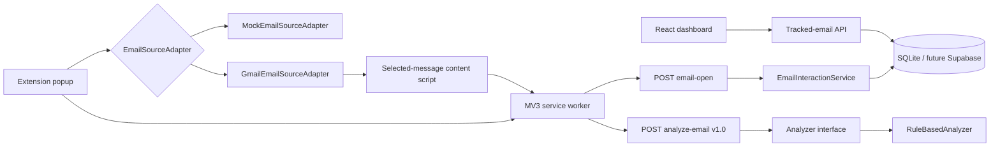

# Architecture

Gmail DOM assumptions are confined to `gmailSelectors.ts` and `GmailEmailSourceAdapter`. The popup, service worker, API client, and backend receive typed metadata and do not know Gmail selectors. Mock mode follows the same contracts and remains the automated-test default.

## Duplicate prevention

The content script debounces mutations by 600 ms and tracks each visible message ID once until another message is selected. FastAPI separately ignores the same user/message `email_open` within five seconds. Reopening later remains countable.

## Analysis pipeline

`Analyzer` currently resolves to `RuleBasedAnalyzer`. `/api/v1/analyze-email` accepts schema version `1.0` and returns behaviors, recommendation, risk, classification, and `modelVersion: null`. Future BRL, text/URL feature extractors, ML classifier, and explanation generator should be introduced behind this boundary. Rule-based results must never be called ML predictions.

See [gmail-integration.md](gmail-integration.md) for operational limitations.
